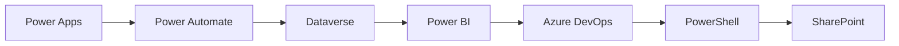

# 💫 About Me:
🔭 I am currently working on 
Enterprise-level Power Platform Governance frameworks, scalable environment strategies, automated compliance monitoring, and ALM-driven deployment pipelinesbr> 

🌱 I am currently learning 
Advancing my skills in Fabric Analytics and exploring the capabilities of Copilot Studio to integrate AI-driven insights into low-code solutions. 

💬 Ask me about 
The CoE Starter Kit, Power Platform governance frameworks, automating administrative tasks with PowerShell, and how to cut manual deployment times through efficient Pipelines and DevOps strategies. 

⚡ Fun Fact 
I’ve spent the last few years acting as a "manual task's worst enemy". I live for the "Aha!" moment when a PowerShell script replaces a repetitive process—a habit that has helped me slash deployment times by 30% , boost delivery speeds by 20%. 

## 🌐 Socials:
 

## 🛠 **Tech Stack**

 
